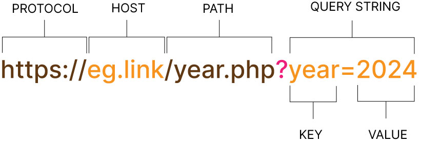

# HTTP Requests and Responses
## What is HTTP?
Hyper Text Transfer Protocol (HTTP) is a set of rules that specify how browsers should request pages and how servers should format their response. It helps to understand what data is sent with each step.

When a web browser requests a PHP page, the browser's address bar shows a URL which specifies how the browser can find that page.

Each URL has:
- A protocol (for web pages it is HTTP or HTTPS)
- A host (the server to send the request to)
- A path that identifies the requested file
- An optional query string with extra data the page might need

When a query string is added to the end of a URL each piece of data it sends is like a variable; it has a:

- Name that describes what data is being sent. The name is the same each time a URL is used.
- Value for the piece of data.

## Client-Side

When a browser requests a web page, it also sends HTTP request headers to the server. They are not shown in the main browser window (like the URL) but they can be viewed in the developer tools that come with most browsers.

The headers hold data the server may find helpful and they are also similar to a variable; they have a:

- Name that describes what data is being sent. The name is the same each time a URL is used.
- Value for the piece of data.

## Server-Side

When the web server receives a request for a PHP pum, it responds to that request by:

- Finding the PHP file requested in the URL
- Getting the PHP interpreter to process any PHP code that the PHP file contains
-  Sending an HTML page back to the browser that requested the page

The server also sends back two pieces of data to indicate whether the request was successful or not:

- A reason phrase that people can read
- A three-digit status code for software to interpret

For successful requests, the status code is 200 and the reason phrase is OK. If a server cannot find a file, the status code is 404 and the reason phrase is Not found. When browsing the web, you may have seen a screen like this, indicating that a page was not found.

### HTTP response status codes

- 100 - 199: Informational responses
- 200 - 299: Successful responses, e.g. 200 OK
- 300 - 399: Redirect Messages, e.g. 301 Moved Permanently, 307 Temporary Redirect
- 400 - 499: Client error responses, e.g. 404 Page not found, 403 Forbidden 
- 500 - 599: Server error responses, e.g. 500 Internal Server Error, 503 Bad Gateway

