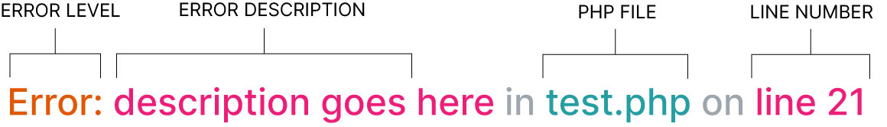

# Error Messages in PHP
When there is a problem with the PHP code, the PHP interpreter generates error messages which help you fix any mistakes.

There are two ways to view the messages, they can be:

- Shown in the HTML that is sent to the browser
- Saved to a text file known as an error log

Each error message contains four pieces of data that help you locate the problem so you can fix it:

- The error level
- A description of the error
- The file that contained the error
- The line number where the error was found

| Level | Description |
|-------|-------------|
| Parse | Errors in the syntax of the PHP code prevent the PHP interpreter from trying to run the page at all |
| Fatal | An error in the PHP code that stops any further code (after the error) from running |
| Warning | Something that will probably cause a problem, but the intepreter tries to run the rest of the page |
| Notice | Something that could indicate an problem, but the intepreter tries to run the rest of the page |
| Deprecated | PHP code that is likely to be removed from future versions of PHP |
| Strict| PHP code that could be written in a better way and will be more future-proof |

