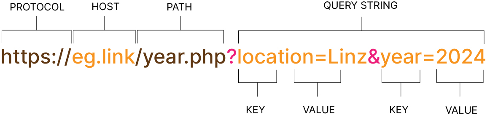

# Sending Data via HTTP GET

When data is added to a query string at the end of the URL, the PHP interpreter adds that data to a superglobal array called $_GET so that the PHP code in the page can access it.



At the end of the URL, there is a query string that holds two key/value pairs which are sent to the server when the visitor clicks on the link.

When the PHP interpreter receives this request, it adds the data from the query string to a superglobal array called $_GET. Like all of the superglobal arrays that the PHP interpreter generates $_GET is an associative array. It is given an element for each name/value pair that is in the query string. The key:

- is the name being sent
- value is the value sent with the name

The code in the PHP file can access the values in the $ GET superglobal array in the same way that it would access values from any associative array : 

```php
    $location = $_GET['location'];
    $year = $_GET['year'];

    echo $location;
    echo $year;
```

In the example below, an array has three elements. Each element holds the city and address of a store. A value in the query string selects which store's data should be shown, so this one PHP file creates three pages of the site, each one is for a different store. The data in the array is also used to create the links that request these three pages.
Try it out and see how it works 😊

```php
<?php
$cities  = [
    'London' => '48 Store Street, WC1E 7BS',
    'Sydney' => '151 Oxford Street, 2021',
    'NYC'    => '1242 7th Street, 10492',
];
$city = $_GET['city'];
$address = $cities[$city];
?>

<?php foreach ($cities as $key => $value) { ?>
  <a href="get-1.php?city=<?= $key?>"><?= $key ?></a>
<?php } ?>

<h1><?= $city ?></h1>
<p><?= $address ?></p>

```

## Handling Missing Data in Superglobal Arrays

If you try to access a key that has not been added to a superglobal array, the PHP interpreter raises an error. To prevent such errors, you can check if the key is in the superglobal array before accessing it.

If a query string is missing data, it can not be added to the $_GET superglobal array. If a PHP file tries to access the data, the PHP interpreter raises an error saying **Undefined array key** or **Undefined Index**, because it is trying to access a key (or index) that does not exist.

### Set value with a ternary operator

```php
  $city = isset($_GET['city']) ? $_GET['city'] : '';
```
